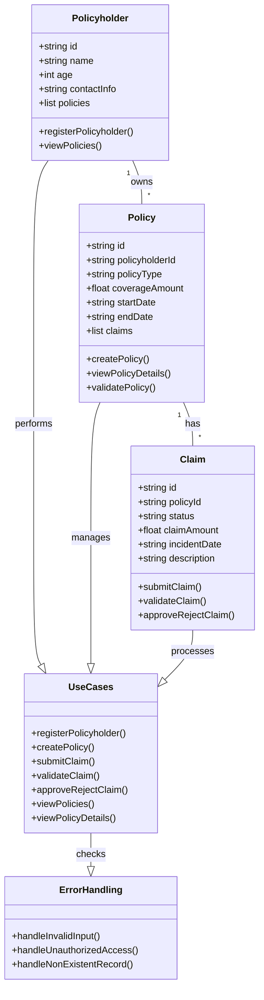

This mermaid diagram represents the **detailed Low-Level Design (LLD)** for the **Claims Management System**:

1. **Entities & Attributes:**
   - **Policyholder:** Registers, owns policies, views policies.
   - **Policy:** Tied to a policyholder, holds claims, validates itself.
   - **Claim:** Linked to a policy, can be submitted, validated, and approved/rejected.

2. **Relationships:**
   - **A policyholder can own multiple policies.**
   - **A policy can have multiple claims.**

3. **Error Handling & Edge Cases:**
   - **handleInvalidInput():** Prevents incorrect data.
   - **handleUnauthorizedAccess():** Restricts access.
   - **handleNonExistentRecord():** Catches requests for missing records.

4. **Use Cases:**
   - Includes **registration, policy creation, claim submission, validation, approval/rejection, and views.**
   - Each action is validated before execution.
   ```